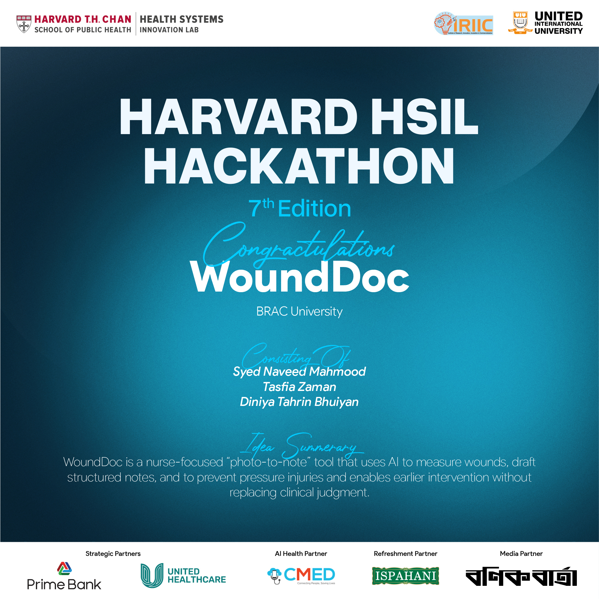

# WoundDoc

AI-assisted bedside documentation and prevention tool for pressure injuries.

## Overview
WoundDoc is a nurse-focused “photo-to-note” clinical copilot for pressure injury documentation and prevention. It helps clinicians draft structured wound assessment notes, generate stage suspicions as non-diagnostic suggestions, and produce risk-linked prevention checklists while keeping clinicians in the loop.

## Hackathons
WoundDoc is being developed for:
- Harvard Health Systems Innovation Lab (HSIL) Hackathon 2026, where it was selected among approximately 650 applicants as one of the Top 22 teams to pitch at the Dhaka Hub
- Gemma 4 Good Hackathon on Kaggle

Relevant links:
- https://www.kaggle.com/competitions/gemma-4-good-hackathon
- https://hsph.harvard.edu/research/health-systems-innovation-lab/work/hsil-hackathon-2026-building-high-value-health-systems-leveraging-ai/

## Problem
Pressure injuries are common, preventable, costly, and often under-documented. Early-stage identification can also be difficult, particularly across different skin tones, making timely documentation and prevention harder in practice.

## Solution
WoundDoc Lite supports a simple workflow:

`Photo -> Risk Form -> Guideline Retrieval -> AI Draft -> Nurse Review -> Export`

Core outputs:
- Structured nursing note draft
- Stage suspicion with uncertainty handling
- Prevention checklist linked to risk factors

## Key Features
- Photo-to-note assistance
- Structured clinical documentation
- Non-diagnostic stage suspicion
- Prevention-focused outputs
- Retrieval-grounded, auditable AI workflow

## Tech Stack
- Gemma 4
- Retrieval-augmented generation (RAG)
- FAISS or Chroma
- Python backend
- Web-based frontend

## Design Principles
- Human-in-the-loop
- Non-diagnostic outputs
- Auditability
- Bias-aware design
- Conservative uncertainty handling

## Disclaimer
WoundDoc is not a diagnostic tool. All outputs are draft suggestions intended for clinician review and should not replace professional medical judgment.

## Team
- Syed Naveed Mahmood
- Tasfia Zaman
- Diniya Tahrin Bhuiyan

